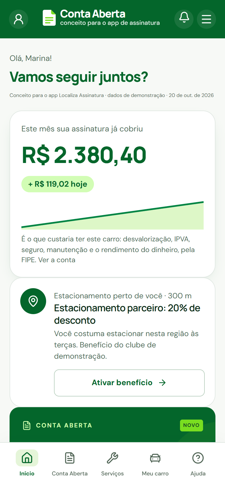
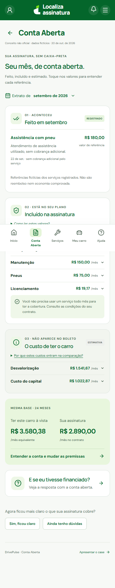
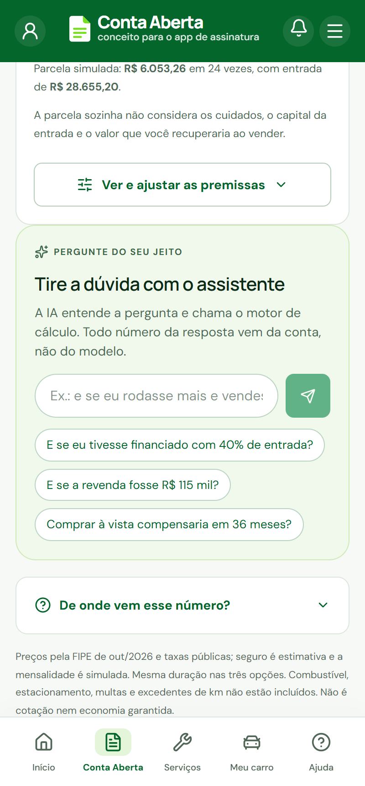
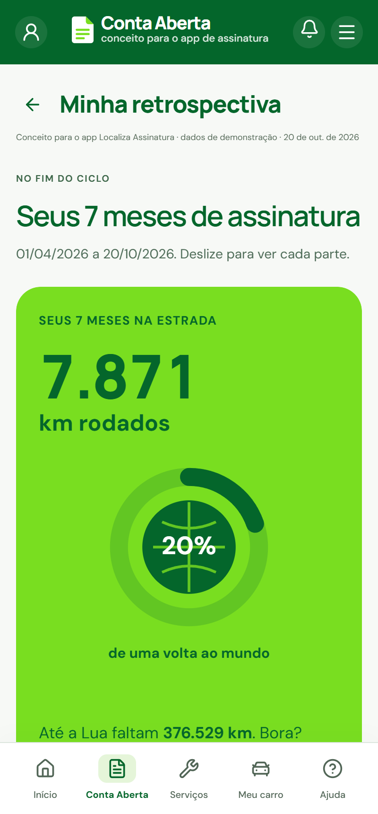
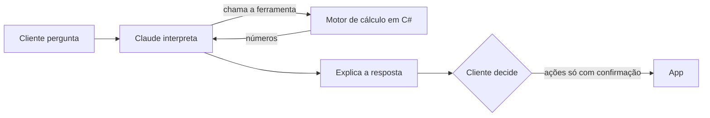

# Conta Aberta

Conceito para o app de carro por assinatura, criado a partir do case da Localiza Assinatura no **Ruptura 2026**, o hackathon da UFMG no Localiza Labs. Depois do evento, continuei o projeto e transformei o protótipo do pitch em um app que funciona de ponta a ponta.

> Projeto independente de portfólio, sem vínculo oficial com a Localiza. Os preços vêm da FIPE e de fontes públicas; o cliente e o histórico de uso são de demonstração.



## O problema

O desafio do case era fazer o app ser útil na rotina do cliente, e não só quando ele tem um problema para resolver. O próprio material da Localiza dá a pista:

- o app tem **NPS 84**, mas a assinatura tem **NPS ~45**, e a oportunidade apontada é "aumentar a percepção de valor da Assinatura" (case, p. 19);
- **36%** de quem abre o app usa menos de 2 vezes por mês, e só **48%** renovam o contrato.

Minha leitura: o cliente paga uma mensalidade e não enxerga o que ela cobre. Ter o mesmo carro custaria IPVA, seguro, manutenção, pneus, a desvalorização e o rendimento do dinheiro parado. Nada disso aparece para ele.

## O que o app faz

| Quando | O que o cliente vê |
|---|---|
| **Todo dia** | Na tela inicial, quanto a assinatura já cobriu no mês (cresce dia a dia) e o benefício do clube que serve para onde ele está. |
| **Toda semana** | O ritmo de km contra a franquia, com plano para evitar excedente. |
| **Todo mês** | A Conta Aberta: o que foi feito, o que está incluído no contrato e o que é estimativa, separados. |
| **Quando quiser** | "Vale a pena?": comparação com comprar à vista ou financiado, premissas editáveis e um **assistente de IA** que responde dúvidas como "e se eu desse 40% de entrada?". |
| **No fim do ciclo** | Uma retrospectiva para compartilhar: km rodados, destino favorito e o valor que a assinatura cuidou. |

| Conta Aberta do mês | Vale a pena? | Retrospectiva |
|---|---|---|
|  |  |  |

## De onde vêm os números

A comparação usa um Hyundai Creta Comfort 1.0 Turbo em 24 meses:

| Premissa | Valor | Fonte |
|---|---|---|
| Preço 0 km | R$ 143.276 | Tabela FIPE out/2026 (015200-5) |
| Revenda em 2 anos | R$ 107.163 | Tabela FIPE out/2026, mesmo modelo, ano 2024 |
| Rendimento do dinheiro | 0,92% ao mês | CDI de 13,65% a.a., menos 15% de IR |
| Juros do financiamento | 1,99% ao mês | 26,61% a.a., média para veículos (set/2026) |
| IPVA | 4% ao ano | SEF/MG |
| Manutenção e pneus | R$ 1.650/ano e R$ 2.300 por jogo | Localiza Seminovos (nov/2025) |
| Seguro | R$ 4.200/ano | Estimativa, cerca de 3% do valor do carro |

Todos os fluxos são trazidos a valor presente e convertidos em um custo mensal equivalente. O resultado também mostra quando comprar sai mais barato.

## Como funciona por dentro



**O número vem da regra, a explicação vem do modelo.** O assistente usa tool use da API da Anthropic: o modelo nunca escreve um valor que não tenha saído do `OwnershipCalculator`. Ele também não executa nenhuma ação: renovar, trocar ou contratar ficam no app, com confirmação do cliente. Sem chave de API configurada, o app usa as perguntas guiadas, que chamam o mesmo motor.

| Camada | Tecnologia |
|---|---|
| API | .NET 10, ASP.NET Core (minimal APIs) |
| Regras | `OwnershipCalculator` e `MileageCalculator`, determinísticos e testados |
| Assistente | SDK oficial da Anthropic para C#, com tool use (ou SDK da OpenAI, com function calling) |
| Banco | PostgreSQL 17 com Entity Framework Core 10 |
| Web | Next.js, React e TypeScript, com proxy de mesma origem para a API |
| Ambiente | Docker Compose |

```text
backend/    API, regras de negócio, assistente, banco e testes
frontend/   App Next.js
docs/       Arquitetura, API e capturas de tela
scripts/    Execução local e teste de integração
```

## Rodar

Com o Docker ativo, na raiz do projeto:

```bash
docker compose up --build -d
```

- App: http://localhost:3000
- Modo apresentação: http://localhost:3000/apresentar
- API: http://localhost:5080/api/v1/account
- OpenAPI: http://localhost:5080/openapi/v1.json

Para ligar o assistente de IA, crie um arquivo `.env` na raiz com `ANTHROPIC_API_KEY=...` antes de subir. Também funciona com a OpenAI (`OPENAI_API_KEY=...`, modelo em `OPENAI_MODEL`, padrão `gpt-5-mini`); se as duas chaves existirem, usa a da Anthropic. O banco recebe os dados de demonstração na primeira execução; `docker compose down -v` apaga a base e recomeça.

## Testes

```bash
cd backend && dotnet test DrivePulse.slnx
cd frontend && npm test && npm run lint && npm run build
```

Os testes do backend cobrem o cálculo de custo de propriedade, a projeção de km, as regras de recomendação, a ferramenta do assistente (inclusive recusar chamadas inválidas em vez de inventar número) e a retrospectiva.

## Limites desta versão

- Um cliente de demonstração, com data de referência fixa (20/10/2026) para os números serem sempre os mesmos.
- O benefício do dia e os destinos da retrospectiva são de demonstração; viriam do clube de benefícios e do carro conectado, com permissão do cliente.
- Sem autenticação; o banco é criado com `EnsureCreated`. Para produção, entrariam login, autorização por cliente e migrações versionadas.

---

Feito por Gabriel Maciel.
