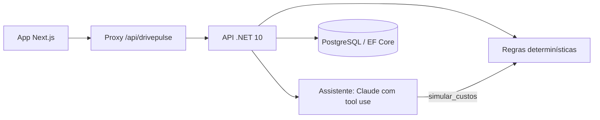

# Arquitetura e decisões

Monólito modular: uma API REST, um banco e um app web. O navegador chama um proxy de mesma origem no Next.js, que repassa para a API em ASP.NET. Regras de negócio e persistência ficam na API; a interface consome os DTOs e não refaz cálculo.

## Domínio

O cliente tem uma assinatura e um carro. O uso diário guarda distância e viagens; os serviços usados guardam um valor de referência. Os acontecimentos do carro formam a linha do tempo, e os alertas descrevem cuidados pendentes. Ações concluídas e eventos de produto são persistidos separadamente: a ação é comportamento de negócio, o evento é interação com a interface.

Valores em dinheiro usam `decimal`. A data de referência é fixa (20/10/2026), para que qualquer pessoa veja os mesmos números em qualquer dia.

## Conta Aberta

`GET /account` monta, a partir das entidades do banco:

- **o extrato do mês fechado**, separando o que foi feito, o que está incluído no contrato e o que é estimativa;
- **o valor coberto no dia**: o custo mensal equivalente de ter o carro, dividido pelos dias do mês e acumulado até hoje;
- **o benefício contextual** do dia (demonstrativo);
- **a retrospectiva** do ciclo: km rodados, equivalências (volta ao mundo, distância até a Lua), destino favorito e quanto a diferença entre o valor coberto e o pago daria para custear.

`OwnershipCalculator` compara comprar à vista, financiar e assinar no mesmo período. Os fluxos são trazidos a valor presente pelo rendimento líquido do dinheiro e convertidos em custo mensal equivalente; a revenda entra no fim. As premissas padrão vêm da FIPE e de fontes públicas (`OwnershipInputs.DemoSources`). O resultado é assinado: se comprar sair mais barato, o app mostra.

## Assistente

`POST /assistant` recebe uma pergunta livre. O Claude recebe uma única ferramenta, `simular_custos`, que chama o `OwnershipCalculator` com as premissas do contrato e só altera o que o cliente mencionou. O prompt proíbe citar valores que não venham da ferramenta, e cada resposta devolve a lista de cálculos feitos, que o app mostra ao cliente.

Decisões:

- **o número vem da regra, a explicação vem do modelo**: a conta é auditável sem a IA;
- **sem ações pelo assistente**: renovar, trocar ou contratar ficam no app, com confirmação;
- **chamadas inválidas viram erro para o modelo**, nunca um número inventado (testado em `ContaAbertaTests`);
- **sem chave configurada, o endpoint responde 503** e o app usa as perguntas guiadas, que chamam o mesmo motor.

## Quilometragem

1.180,65 km em 20 dias × 31 dias = 1.830 km projetados, 330 km acima da franquia, ou R$ 247,50 à tarifa de demonstração de R$ 0,75/km. É uma estimativa de ritmo, não uma previsão estatística. A API devolve também o km diário seguro para o resto do mês.

## Fora do escopo

Demonstração com um cliente: sem autenticação, cobrança, agenda real de oficinas, autorização por cliente ou integração com o carro conectado. O banco é criado com `EnsureCreated`; para produção, entrariam migrações versionadas, login e um desenho de privacidade para dados de localização.
