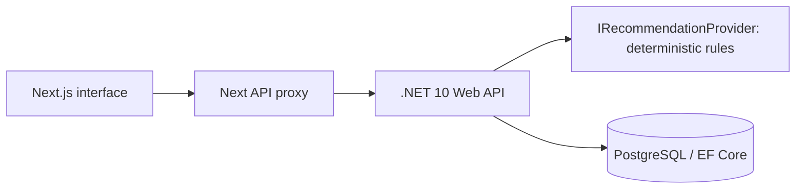

# Architecture and product decisions

DrivePulse is a modular monolith: one REST API, one database, one web application. The browser calls the same-origin Next proxy; the proxy forwards to ASP.NET. Business rules and persistence live in the API. The UI consumes typed DTOs and does not reimplement recommendation logic.

## Domain

Customer owns a subscription and its vehicle. Daily usage captures distance and trips; immutable service usages record reference values for included services actually used. Vehicle events form the timeline. Alerts describe pending care. Completed actions and product events are persisted independently: an action is business behavior, while an event is a product interaction.

Money uses decimal in the API. Dates use ISO strings at the boundary. Performed service reference prices are illustrative. AccountService separates these from included coverage and estimated ownership costs. OwnershipCalculator adds an explicit hypothetical cost-of-ownership comparison with editable assumptions; it is not a live quote. No real vehicle telemetry or integrations are implied.

## Conta Aberta and decision support

The subscriber journey follows the user's original case prototype: monthly statement, explained comparison, next-contract options and shareable recap. GET /account derives its DTO from the existing PostgreSQL entities. POST /comparison calculates ownership using price, down payment, installments, monthly operating provisions, discount yield and end-period resale. The engine returns signed differences, so a cheaper ownership scenario is displayed honestly. No services are double-counted as savings.

The fixed reference is October 20; the latest closed statement is September. Recap spans the actual subscription period through the reference date. Coverage availability is excluded from performed services: three records sum to R$1,150. Guided questions use deterministic calculations, with no LLM or free-text chatbot.

Contract planning retains the actual March 2028 end date. The three completed months average 1,425 km, so the 1,000-km option is not recommended. Interest confirmation uses existing CompletedAction persistence and advisory locking, with no schema expansion or actual contract change. Product events track statement views, comparisons, contract options and recap shares; improved retention/NPS remains an unvalidated hypothesis.

## Mileage anticipation

The scenario is intentionally frozen on October 20, 2026, allowing a reviewer to see the same story on any date. 1,180.65 km / 20 elapsed days × 31 days = 1,830 km projected. The 330 km excess would cost R$247.50 at the illustrative contract rate of R$0.75/km. This is a simple pace estimate, not a statistical prediction. The API returns the remaining safe daily budget and selects a useful next action.

## Future recommendation agent

The application depends on IRecommendationProvider. The current implementation uses explicit priority rules and explainable reasons. A later provider can use an agent while keeping the same DTO and user-action workflow. It must retain deterministic safety checks, structured output, traceable reasons, bounded external calls and explicit user confirmation of vehicle-service actions. No agent SDK, OpenAI library or API key exists in this MVP.

## Scope

This is a local fictional demonstration. It deliberately does not have production authentication, billing, real appointment availability, multi-tenant authorization or vehicle integrations. Demonstrated appointment/document actions persist in the demo system; they do not contact a service center. The admin area reports tracked demo interactions and completed actions, not business-wide analytics. Production exposure requires a separate authentication and privacy design.
